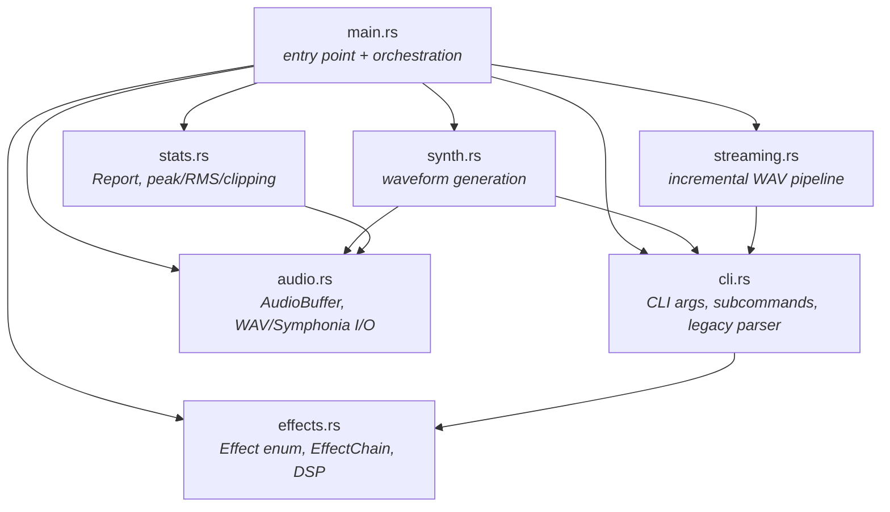
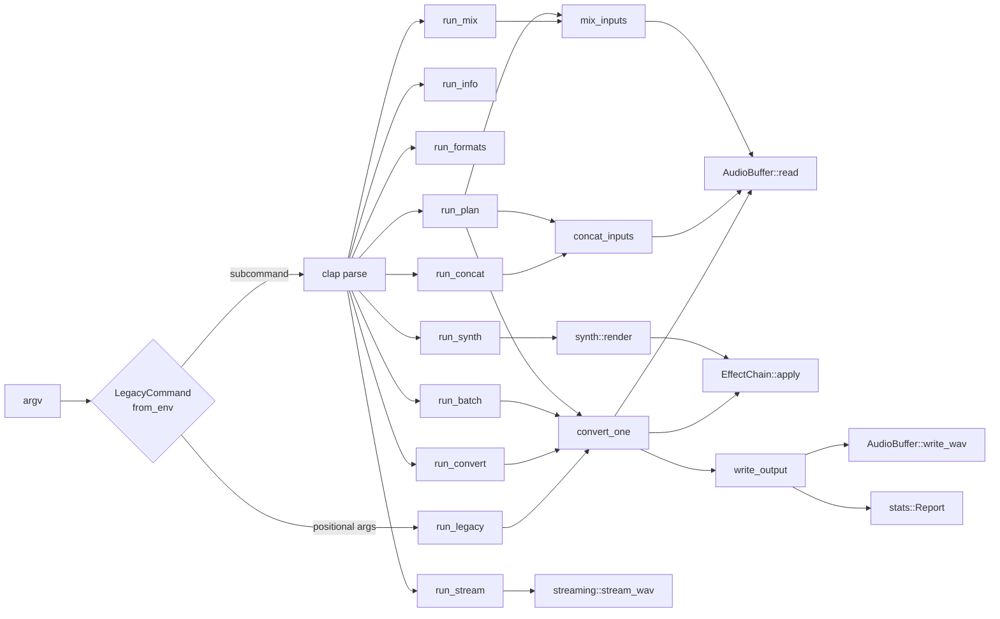
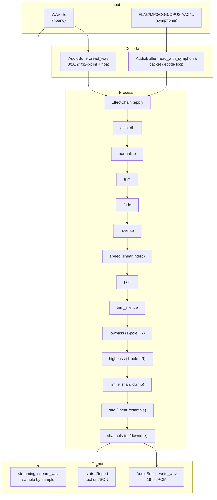
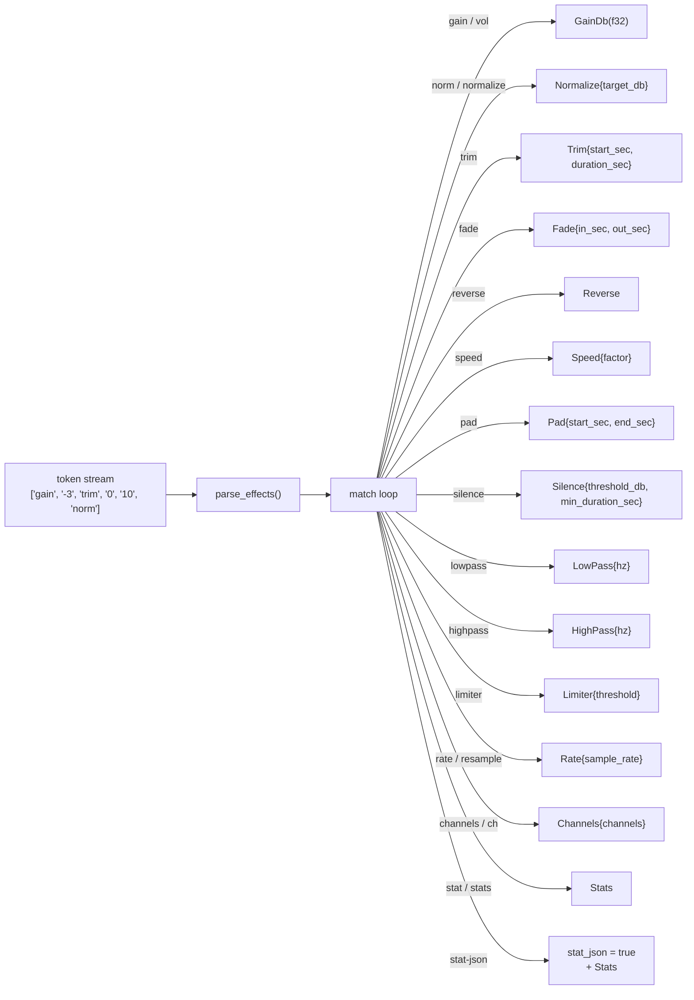
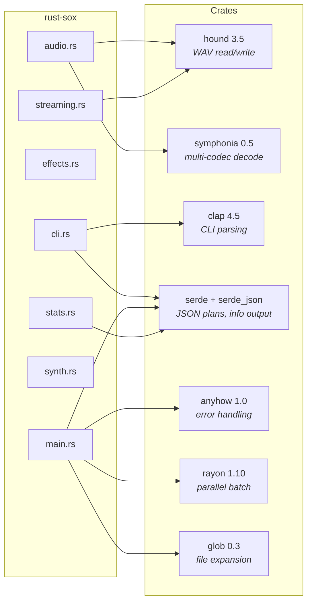
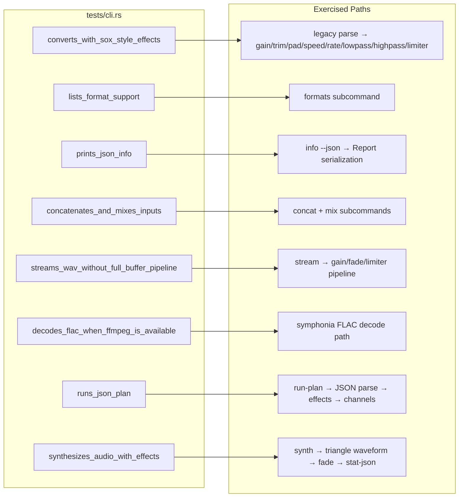

# sox (rust-sox) Knowledge Maps

## 1. Module Dependency Map



## 2. Type Relationship Map

```mermaid
classDiagram
    class AudioSpec {
        +u32 sample_rate
        +u16 channels
    }

    class AudioBuffer {
        +AudioSpec spec
        +Vec~f32~ samples
        +read(path) Result~Self~
        +read_wav(path) Result~Self~
        +write_wav(path) Result~()~
        +frames() usize
        +duration_seconds() f64
        +peak() f32
    }

    class Effect {
        <<enum>>
        GainDb(f32)
        Normalize{target_db}
        Trim{start_sec, duration_sec}
        Fade{in_sec, out_sec}
        Reverse
        Speed{factor}
        Pad{start_sec, end_sec}
        Silence{threshold_db, min_duration_sec}
        LowPass{hz}
        HighPass{hz}
        Limiter{threshold}
        Rate{sample_rate}
        Channels{channels}
        Stats
    }

    class EffectChain {
        -Vec~Effect~ effects
        +new(effects) Self
        +apply(audio) Result~()~
        +wants_stats() bool
    }

    class Report {
        +PathBuf path
        +AudioSpec spec
        +usize frames
        +f64 duration_seconds
        +f32 peak
        +f32 rms
        +usize clipped_samples
        +from_audio(path, audio) Self
    }

    class Commands {
        <<enum>>
        Info
        Formats
        Convert
        Concat
        Mix
        Synth
        Stream
        Batch
        RunPlan
    }

    class ProcessingPlan {
        +PlanMode mode
        +Vec~PathBuf~ inputs
        +PathBuf output
        +Vec~String~ effects
        +bool normalize
        +bool stat_json
    }

    AudioBuffer *-- AudioSpec
    EffectChain o-- Effect
    Report *-- AudioSpec
    Report ..> AudioBuffer : from_audio
    EffectChain ..> AudioBuffer : apply
```

## 3. CLI Command Routing



## 4. Audio Data Flow



## 5. Call Graph (Key Functions)

```mermaid
graph TD
    main_fn["main()"] --> run["run()"]
    run --> legacy["LegacyCommand::from_env()"]
    run --> run_info["run_info()"]
    run --> run_formats["run_formats()"]
    run --> run_convert["run_convert()"]
    run --> run_concat["run_concat()"]
    run --> run_mix["run_mix()"]
    run --> run_synth["run_synth()"]
    run --> run_stream["run_stream()"]
    run --> run_batch["run_batch()"]
    run --> run_plan["run_plan()"]

    run_convert --> convert_one["convert_one()"]
    run_batch --> convert_one
    run_plan --> convert_one
    convert_one --> ab_read["AudioBuffer::read()"]
    convert_one --> ec_apply["EffectChain::apply()"]
    convert_one --> write_output["write_output()"]

    run_concat --> concat_inputs["concat_inputs()"]
    concat_inputs --> ab_read
    run_mix --> mix_inputs["mix_inputs()"]
    mix_inputs --> ab_read
    mix_inputs --> sample_at["sample_at()"]

    run_synth --> synth_render["synth::render()"]
    synth_render --> waveform_sample["waveform_sample()"]
    synth_render --> noise_next["Noise::next()"]

    run_stream --> stream_wav["streaming::stream_wav()"]
    stream_wav --> stream_samples["stream_samples()"]
    stream_samples --> fade_factor["fade_factor()"]

    write_output --> ab_write["AudioBuffer::write_wav()"]
    write_output --> report_from["Report::from_audio()"]

    ec_apply --> gain_db["gain_db()"]
    ec_apply --> normalize["normalize()"]
    ec_apply --> trim["trim()"]
    ec_apply --> fade["fade()"]
    ec_apply --> reverse["reverse()"]
    ec_apply --> speed["speed()"]
    ec_apply --> pad["pad()"]
    ec_apply --> trim_silence["trim_silence()"]
    ec_apply --> lowpass["lowpass()"]
    ec_apply --> highpass["highpass()"]
    ec_apply --> limiter["limiter()"]
    ec_apply --> rate_fn["rate()"]
    ec_apply --> convert_channels["convert_channels()"]

    ab_read --> read_wav["AudioBuffer::read_wav()"]
    ab_read --> read_symphonia["AudioBuffer::read_with_symphonia()"]
    read_wav --> read_int_samples["read_int_samples()"]

    run_plan --> parse_effects["parse_effects()"]
    legacy --> parse_effects
```



## 6. Effect Parser Token Flow



## 7. External Crate Dependencies



## 8. Test Coverage Map



## 9. File Inventory

| File | Lines | Role |
|------|-------|------|
| `src/main.rs` | 496 | Entry point, command dispatch, batch/concat/mix/plan orchestration, effect token parser |
| `src/cli.rs` | 368 | Clap derive structs, legacy SoX arg parser, JSON plan deserialization |
| `src/audio.rs` | 242 | `AudioBuffer` + `AudioSpec`, WAV read/write via hound, Symphonia multi-codec decode |
| `src/effects.rs` | 403 | `Effect` enum (14 variants), `EffectChain`, all DSP implementations |
| `src/stats.rs` | 58 | `Report` struct with peak/RMS/clipping, text + JSON display |
| `src/streaming.rs` | 173 | Incremental WAV-to-WAV pipeline (gain, fade, limiter) |
| `src/synth.rs` | 79 | Waveform generation (sine, square, triangle, saw, noise, silence) |
| `tests/cli.rs` | 255 | 8 integration tests covering all major command paths |
| `Cargo.toml` | 16 | 7 dependencies, Rust 2024 edition |
| **Total src** | **1,819** | |
